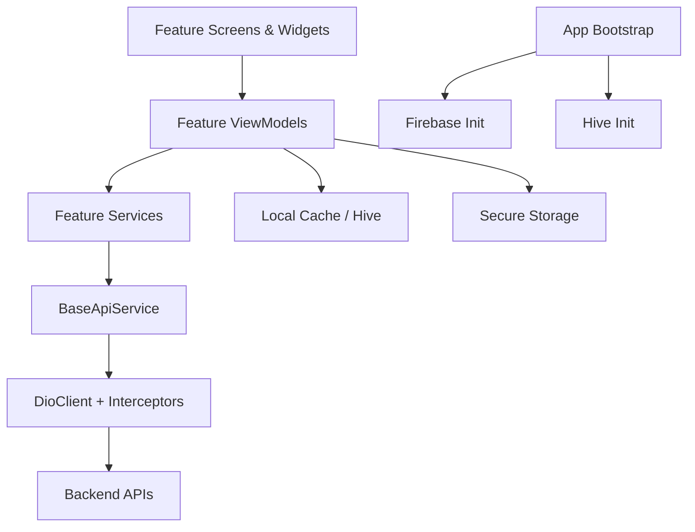
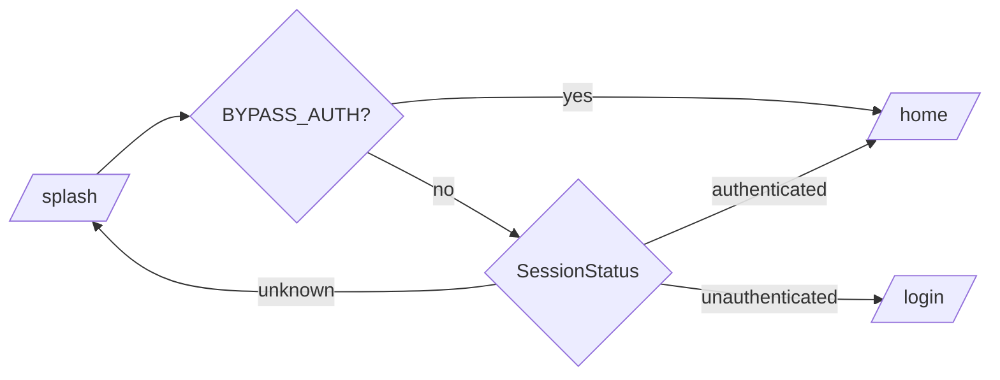

# Dokomandu Architecture

## 1. Purpose
This document describes the production-oriented architecture for the Dokomandu mobile app.

Scope:
- Flutter mobile client only
- API consumption only (no backend logic)
- MVVM with feature modules
- Material 3 UI system

Explicitly out of scope:
- Clean Architecture layering
- Server-side implementation details

## 2. Architecture Goals
- Keep modules independently maintainable
- Make UI reactive and testable with Riverpod
- Keep business logic out of widgets
- Centralize networking, storage, and error handling
- Support static mode for parallel UI development
- Keep onboarding cost low for new developers

## 3. High-Level Structure
```text
lib/
  app/      -> app shell, routes, theme, runtime config
  core/     -> network, API wrapper, storage, shared utilities
  features/ -> module-specific MVVM implementation
  shared/   -> cross-feature models/providers/widgets
```

## 4. System View


## 5. Layer Responsibilities

### 5.1 app/
Responsibilities:
- App bootstrap and root widget
- Route graph and redirect rules
- Material 3 theme tokens and theme switching
- Runtime flags (`API_BASE_URL`, `BYPASS_AUTH`, `USE_STATIC_CONTENT`)

Key files:
- `lib/app/config/app_config.dart`
- `lib/app/config/app_bootstrap.dart`
- `lib/app/routes/app_router.dart`
- `lib/app/theme/*`

### 5.2 core/
Responsibilities:
- Shared network setup with Dio
- Interceptor chain (auth, refresh token, retry, logging)
- API response parsing and exception mapping
- Storage wrappers (secure, local cache, Hive)
- Shared reusable widgets and utilities

Key files:
- `lib/core/network/dio_client.dart`
- `lib/core/network/interceptors/*.dart`
- `lib/core/api/base_api_service.dart`
- `lib/core/errors/app_exception.dart`
- `lib/core/storage/*.dart`

### 5.3 features/
Responsibilities:
- Domain-specific app behavior per module
- Module-local model/service/viewmodel/screen/widget
- API calls delegated through module services

Pattern per feature:
```text
features/<module>/
  models/
  services/
  viewmodels/
  screens/
  widgets/
```

### 5.4 shared/
Responsibilities:
- Cross-feature entities (e.g., `UserModel`, `OrderModel`)
- Global providers wiring (`app_providers.dart`, `session_provider.dart`)
- Reusable shared widgets (e.g., shell scaffold)

## 6. MVVM in This Codebase

### View (Screens/Widgets)
- Contains rendering and interaction wiring only
- Reads state from Riverpod providers
- Dispatches intents to ViewModels

### ViewModel
- Holds UI state and transitions
- Handles loading/success/error/empty flow
- Coordinates services and optionally other providers
- Implemented via:
- `AsyncNotifier` for async-loaded state
- `StateNotifier` for mutable local state

### Service
- Performs API and data operations
- No widget logic and no direct UI dependencies
- Respects `AppConfig.useStaticContent` when applicable

## 7. State Management Strategy (Riverpod)

### Provider Types Used
- `Provider<T>`: dependency construction and DI
- `StateNotifierProvider`: mutable state with explicit methods
- `AsyncNotifierProvider`: async lifecycle + reactive loading state
- `FutureProvider.family`: request-by-parameter read models

### State Shape Convention
Each feature state should model:
- Loading
- Data
- Error
- Empty (handled by UI based on returned data)

## 8. Navigation and Auth Flow
GoRouter is the single navigation source of truth.

Primary routes:
- `/` splash
- `/login`, `/otp`
- `/home`, `/cart`, `/orders`, `/profile` (shell tabs)
- `/kitchens`, `/kitchens/:id`
- `/checkout`, `/order-success/:id`
- `/notifications`, `/orders/:id`, `/profile/edit`

Redirect behavior (`app_router.dart`):
- If `BYPASS_AUTH=true`: splash/auth routes redirect to home
- Otherwise route access depends on `sessionProvider` state



## 9. Data Flow and Network Pipeline

### Request Lifecycle
1. Screen triggers ViewModel action
2. ViewModel calls Feature Service
3. Service uses `BaseApiService`
4. `DioClient` executes request with interceptors
5. Parsed model returned to ViewModel
6. ViewModel emits new state to UI

### Interceptors
- `AuthInterceptor`: injects `Authorization` header
- `RefreshTokenInterceptor`: handles `401` and refresh token exchange
- `RetryInterceptor`: retries transient timeout/network failures
- `LogInterceptor`: debug logging in debug mode

## 10. Session and Token Management
Session source of truth:
- `shared/providers/session_provider.dart`

Stored securely:
- Access token
- Refresh token
- User JSON
- FCM token

Storage backend:
- `flutter_secure_storage` via `SecureStorageService`

## 11. Local Storage and Caching
- Theme prefs: SharedPreferences via `LocalCacheService`
- Cart persistence: Hive via `HiveStorageService`
- Session secrets: Secure Storage

## 12. Static Content Mode
`USE_STATIC_CONTENT=true` routes feature services to `DummyData` and simulated delay.

Why this matters:
- Enables UI and flow development before backend readiness
- Supports demos and deterministic visual testing

Features currently honoring static mode include:
- Home, kitchen, menu, checkout
- Orders, notifications, profile
- Location

## 13. Firebase Messaging Initialization
Bootstrap behavior:
- App initializes Firebase in `AppBootstrap.initialize()`
- If Firebase config is missing, app continues without crash
- FCM setup is skipped gracefully and logged

This allows developers to run UI flows before provisioning Firebase files.

## 14. UI Architecture
- Material 3 design tokens in `app/theme/`
- Light + dark themes
- Brand color: `#193CB8`
- Font system: Nunito Sans
- Shared components for empty/error/loading/shimmer/buttons/fields
- Shell-level navigation with `NavigationBar`

## 15. Error Handling Strategy
- `BaseApiService` catches Dio exceptions
- `AppException` maps transport/API failures to user-friendly messages
- Feature ViewModels expose user-safe error states
- UI renders reusable `AppErrorState` with optional retry

## 16. Performance and Scalability Considerations
- Lazy list rendering for module lists
- Pagination support in kitchen listing
- Targeted retry for transient failures
- Cached network images for food/kitchen media
- Avoiding unnecessary global rebuilds via provider granularity
- Feature isolation for parallel team development

## 17. Adding a New Feature Module
1. Create `features/<new_feature>/` with MVVM folders
2. Add models first (API contract shape)
3. Add service methods using `BaseApiService`
4. Add ViewModel state transitions
5. Add screens/widgets
6. Add routes in `app_router.dart` and `route_paths.dart`
7. Reuse shared UI components and theme tokens
8. Add static mode branch if backend endpoint is not yet ready

## 18. Known Technical Debt / Next Improvements
- Add integration tests for critical flows (auth/cart/checkout)
- Add explicit connectivity-aware UX fallback for offline states
- Align Android/iOS manifest/plist permission docs with final production permissions
- Replace debug signing with release signing config before store deployment
- Optionally split large screens into finer presentation widgets as features expand

## 19. Decision Summary
- MVVM chosen for pragmatic clarity and delivery speed
- Feature-first folder layout chosen for scalability
- Riverpod chosen for strong reactive patterns and DI
- Centralized Dio pipeline chosen for consistency and security
- Static mode retained to decouple frontend iteration from backend readiness
